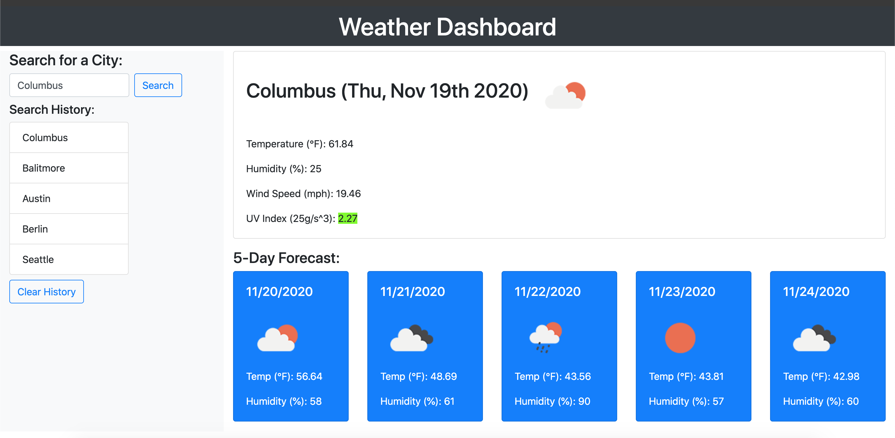

# Philip-DiPaula-OSU-bootcamp-hwk6

## These are the files for the sixth OSU Web Development Bootcamp Homework Assignment

Here is a [link](https://pjdip.github.io/Philip-DiPaula-OSU-bootcamp-hwk6/) to the live page :D

The goal of this assignment was to build a simple weather dashboard app using an api. The app allows the user to search for a city and find current and future weather data, while storing searches in a displayed history list. We are building off of some of our recently developed skills by using moment.js and jQuery again in this app.

* [Installation](#installation)
* [Usage](#usage)
* [Credits](#credits)
* [Badges](#badges)
* [License](#license)

## Installation

The only thing you will need to have installed in order to run the index.html file is a functioning web browser. It should work with most versions of most browswers. I recommend the Brave browser, as you will be paid in the Basic Attention Token (BAT) for viewing ads, instead of being bombarded with ads and getting nothing for it. The webpage will require access to the localStorage on your browser in order to save the search history properly.

## Usage 

In order to use this project, simply open the index.html in your favorite browser or open the link provided above. Type in the name of a city in the search field on the left and click the "Search" button. Searched cities will be listed below in the "Search History" and can be cleared with the "Clear History" button. Current weather data and the 5 day forecast will be populated if you enter a valid city name. If you click the name of a city in the "Search History," the weather data for that city will be displayed. Reloading the page will display weather data for the city at the top of the "Search History."

## Credits

Special Thanks to openweathermap.org for various api documentation:
* [weather object response data](https://openweathermap.org/weather-data)
* [uv-index](https://openweathermap.org/api/uvi)
* [current weather](https://openweathermap.org/current#data)
* [5 day forecast](https://openweathermap.org/forecast5)
* [conditions icons](https://openweathermap.org/weather-conditions#Weather-Condition-Codes-2)

Thanks to bootstrap documentation for help with:
* [sidebar formatting](https://getbootstrap.com/docs/4.5/examples/dashboard/)
* [search field formatting](https://getbootstrap.com/docs/4.5/components/navbar/)
* [card formatting](https://getbootstrap.com/docs/4.5/components/card/)

Thanks to stackoverflow for help with:
* [string manipulation](https://stackoverflow.com/questions/1026069/how-do-i-make-the-first-letter-of-a-string-uppercase-in-javascript)
* [moment formatting and display](https://stackoverflow.com/questions/35441820/moment-js-tomorrow-today-and-yesterday)

Thanks to [wikipedia](https://en.wikipedia.org/wiki/Watt) and [the epa](https://www.epa.gov/sites/production/files/documents/uviguide.pdf) for info on the UV index units

Thanks to MDN for [array manipulation](https://developer.mozilla.org/en-US/docs/Web/JavaScript/Reference/Global_Objects/Array/unshift)

Special Thanks to [ChilledCow](https://www.youtube.com/channel/UCSJ4gkVC6NrvII8umztf0Ow) for providing chill lofi beats to code to

## Badges

## License

Licensed under the [GNU General Public License v3.0](https://choosealicense.com/licenses/gpl-3.0/)

---